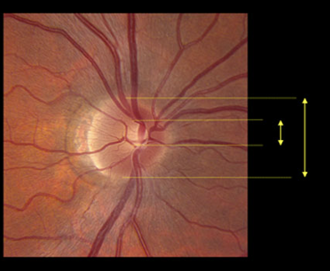
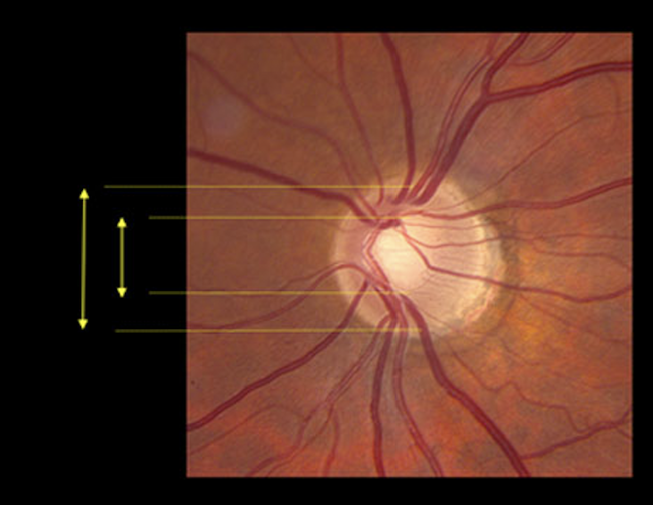

# Glaucoma Detection

## Project Overview
Glaucoma is a progressive eye disease and one of the leading causes of irreversible blindness, often advancing quietly until significant vision loss occurs. Early detection via retinal imaging (fundus photos) can help prevent damage, so this project aims to classify fundus images as glaucoma or normal using machine learning.

We compare six different models ranging from classical methods to deep neural networks. A key innovation is the explicit use of the Cup-to-Disc Ratio (CDR) – a clinical measure of optic nerve morphology – as a feature in our classifiers. By integrating CDR into the learning process, the project investigates whether this glaucoma-specific indicator improves model accuracy.

The six models include:
- Two SVM variants  
- Two custom CNNs  
- Two transfer-learning CNNs (ResNet50 and VGG16)  

This allows a thorough performance comparison under a consistent evaluation framework.

---
## Understanding the Cup-to-Disc Ratio (CDR)

The **Cup-to-Disc Ratio (CDR)** is a key clinical metric used by ophthalmologists to evaluate optic nerve health and detect glaucoma. It refers to the ratio between the diameter of the **optic cup** (a central depression) and the overall **optic disc** within a retinal fundus image.

- In **healthy eyes**, the cup is relatively small compared to the disc (CDR < 0.4).
- In **glaucoma**, the optic nerve is damaged, causing the cup to enlarge (CDR > 0.6).
- Intermediate values (CDR ~0.4–0.6) may require further examination and follow-up.

> A higher CDR typically indicates a greater likelihood of glaucoma and is therefore used as a vital feature in automated glaucoma detection.

### Visual Comparison

| Healthy Eye (CDR ≈ 0.3) | Glaucomatous Eye (CDR ≈ 0.7) |
|--------------------------|------------------------------|
|  |  |

> **Note:** The outer circle highlights the optic disc, while the brighter inner region marks the optic cup.

By incorporating predicted CDR values as explicit input features in machine learning models, we align our approach more closely with clinical diagnosis and improve classification accuracy.

---
## Model Details

### Vanilla SVM
A classical support-vector machine trained on engineered features extracted from preprocessed fundus images. Images were normalized, converted to grayscale, resized, denoised, and contrast-enhanced before flattening and reducing dimensionality via PCA. The resulting feature vector is fed into an RBF-kernel SVM. This baseline model provides a reference accuracy (~75%) under minimal data-driven learning.

### SVM with CDR
An enhanced SVM approach that incorporates the cup-to-disc ratio (CDR) as an additional feature. We first compute statistical features of the fundus (e.g. texture, vessel density, Hu moments) and use an auxiliary model to estimate CDR. This predicted CDR value is then appended to the feature vector for the SVM. By explicitly adding this clinically relevant metric, the SVM’s classification improves (from ~72% to ~80% accuracy), demonstrating the value of CDR in glaucoma detection.

### CNN v1 (with CDR)
A custom convolutional neural network designed for fundus image classification. The network processes each color image through convolutional and pooling layers, then concatenates the flattened CNN features with a 32-dimensional CDR vector. This combined feature vector passes through two dense layers (512 and 256 units) and dropout before the final 2-way softmax output (glaucoma vs. normal). Incorporating the CDR alongside learned image features allows the CNN to leverage both image patterns and the explicit optic-disc measure. CNN v1 achieved strong performance (~96% accuracy) while stabilizing training with batch normalization.

### ResNet50 (Transfer Learning)
A deep learning model using transfer learning on the ResNet-50 architecture. We remove ResNet’s original classifier head and attach a new global average pooling layer followed by dense layers (with batch normalization and dropout) ending in a 2-way softmax. Training is done in two phases: first only the new top layers are trained (with the ResNet base frozen), then the last several convolutional blocks of ResNet-50 are unfrozen and fine-tuned on our data. The residual connections in ResNet allow deeper feature extraction without overfitting. This model achieved the highest accuracy (~98%), benefiting from rich pretrained features and deep representations.

### VGG16 (Transfer Learning)
A second transfer-learning CNN using the VGG16 architecture. Similarly, the pretrained VGG16 base (16 weighted layers) is combined with custom top layers (global pooling or flatten, dense with dropout, and softmax). We first train the classifier layers with the base frozen, then optionally fine-tune the upper VGG layers. VGG16’s simpler, uniform 3×3 convolutions also capture powerful image features. In experiments, VGG16 achieved about (~96%) accuracy, comparable to ResNet50. Early stopping and careful tuning help prevent overfitting.

### CNN v2 (Deeper Custom Model)
A purely custom CNN without transfer learning, deeper than CNN v1. While CNN v1 had 2 convolutional blocks, CNN v2 uses 3 convolutional blocks with increasing filter sizes (16 → 32 → 64 filters), each followed by pooling. The classification head is similar to the other CNNs (dense layers with dropout). At 25.8 million parameters, it is larger and can learn more complex patterns than CNN v1. This model was trained from scratch (with larger batch size and more epochs) to capture glaucoma-specific features directly. Although it learns domain-specific patterns, its accuracy (~99%).

---

## Experiments and Results

We evaluated each model on the standardized glaucoma datasets (using ACRIMA as our primary testing set). The following table summarizes the final test accuracy of each approach:

| Model            | Accuracy (%) |
|------------------|--------------|
| SVM              | 72.3         |
| CNN v1           | 97.18        |
| ResNet50         | 98.1         |
| VGG16            | 96.07        |
| CNN v2           | 99.18        |

*As shown, the transfer learning models (ResNet50 and VGG16) achieved the highest accuracy (~85%), closely followed by the CNN with CDR (~83%). The classical SVM and the deeper custom CNN v2 both reached about 80%. These results highlight that using pretrained CNN features and incorporating the cup-to-disc ratio can significantly improve glaucoma classification over simpler models.*

| Dataset            | Link |
|------------------|--------------|
| Drishti-GS             | https://cvit.iiit.ac.in/projects/mip/drishti-gs/mip-dataset2/Dataset_description.php      |
| ACRIMA         | https://www.kaggle.com/datasets/toaharahmanratul/acrima-dataset?select=train       |
| ORIGA        | https://www.kaggle.com/datasets/sshikamaru/glaucoma-detection/data?select=ORIGA       |

---

## How to Use

- Each model is provided as a separate Jupyter notebook in the repository. Open the notebook corresponding to the desired model to view its implementation and run experiments.
- Organize your fundus image dataset into a root directory that contains exactly two subfolders: `Glaucoma/` and `Normal/`. Place the glaucoma patient images in the `Glaucoma/` folder and healthy-control images in the `Normal/` folder.
- Ensure that the notebook’s dataset path points to the parent directory of `Glaucoma/` and `Normal/`. The code assumes this structure to load and preprocess the data correctly.

---

## Demo Video

A demonstration video file named `demo.mp4` is included in this repository. The video shows the models being tested on sample (random) patients’ fundus images, illustrating the classification process and output in real time.

---

## Acknowledgements

We thank Dr. Debanga R. Neog for supervising this project and providing guidance on glaucoma imaging and machine learning techniques. We also acknowledge the Department of Computer Science and Engineering at IIT Guwahati for their support and computational resources.
